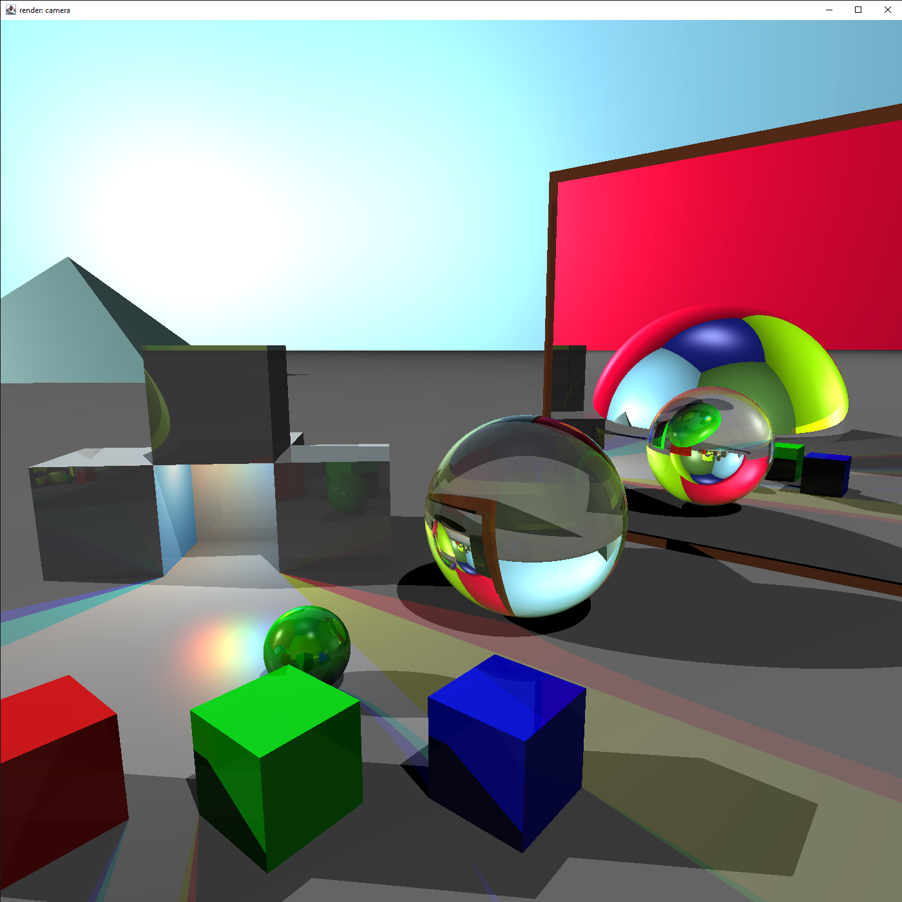
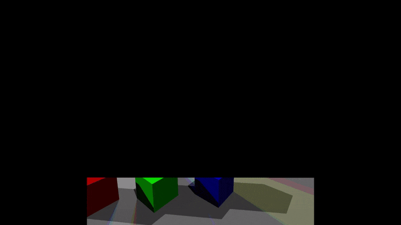

# Raytracer

## modules

### desktop visualizer
desktop interface for the raytracer

### raytracer api
api module defining the interface for a raytracer
- input: scene, camera(pixels wide, pixels high, position, direction)
- output: stream of pixels (x,y, color). pixels represent a change in color, not an absolute color.

### raytracer
implementation of the api  
- first phase: rays without reflection (see release v1)
- second phase: reflection and refraction (with fresnel)

### demo scene

Render of the demo scene:

[short clip of the render](tracing-demo-scene.mp4)
